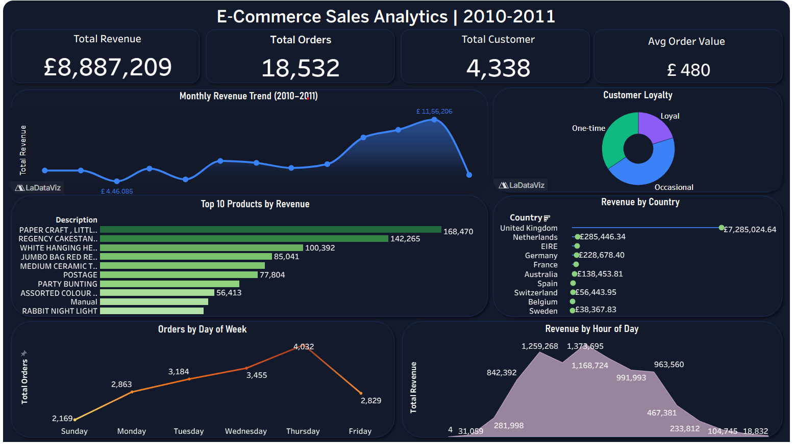

# 🛒 E-Commerce Customer Analytics & Recommendation System


## 🔗 Live Links
| Resource | Link |
|---|---|
| 🚀 Live App | [Click Here](https://yourname-ecommerce-analytics.streamlit.app) |
| 📊 Tableau Dashboard | [Click Here](https://public.tableau.com/views/E-CommerceSalesAnalytics2010-2011/SalesAnalyticsDashboard?:language=en-US&:sid=&:redirect=auth&:display_count=n&:origin=viz_share_link) |

---

## 📌 Project Overview
An end-to-end data analytics and machine learning project
built on 397,884 real e-commerce transactions from the
UCI Online Retail Dataset (2010–2011).

This project covers the full data pipeline — from raw data
cleaning to a live deployed web application — targeting
both Data Analyst and Data Scientist roles.

---

## 🖼️ Screenshots

### Streamlit App


### Tableau Dashboard


---

## 🗂️ Project Structure
ecommerce-analytics/
├── data/
│   ├── raw/                  ← Original dataset
│   ├── cleaned/              ← Cleaned CSV
│   ├── rfm/                  ← RFM segments
│   ├── recommendations/      ← Product recommendations
│   ├── sql_results/          ← SQL query outputs
│   └── charts/               ← All chart images
├── notebooks/
│   ├── 01_data_cleaning.ipynb
│   ├── 02_eda.ipynb
│   ├── 03_sql_analysis.ipynb
│   ├── 04_rfm_segmentation.ipynb
│   ├── 05_churn_model.ipynb
│   └── 06_recommendation.ipynb
├── dashboard/                ← Tableau files + screenshots
├── models/                   ← Saved ML models (.pkl)
├── app/                      ← Streamlit app
└── README.md

---

## ⚙️ Tech Stack
| Category | Tools |
|---|---|
| Language | Python 3.10 |
| Data Processing | Pandas, NumPy |
| Visualization | Matplotlib, Seaborn, Plotly |
| Database | PostgreSQL, SQLite |
| Dashboard | Tableau Public |
| Machine Learning | Scikit-learn |
| Deployment | Streamlit Cloud |
| Version Control | Git, GitHub |

---

## 📊 Phase 1 — Data Cleaning
- Loaded 541,909 raw transactions from UCI dataset
- Removed 135,000+ rows with missing CustomerID
- Filtered cancellations and returns
- Engineered TotalPrice column (Quantity × UnitPrice)
- Final clean dataset: 397,884 rows across 8 columns

---

## 📈 Phase 2 — Exploratory Data Analysis
- Analyzed revenue trends across 13 months
- Identified November 2011 as peak month (£1.16M)
- UK accounts for 84% of total revenue
- Peak shopping hours: 10am–2pm on Thursdays
- Top product generates 3x average product revenue

**Tools:** Python, Pandas, Matplotlib, Seaborn

---

## 🗄️ Phase 3 — SQL Analysis (PostgreSQL)
- Loaded 397,884 rows into PostgreSQL database
- Wrote 10 business-focused queries including:
  - Monthly revenue trends
  - Customer loyalty segmentation
  - Month-over-Month growth rate
  - Revenue by country and day of week
- Used advanced SQL: CTEs, Window Functions (LAG),
  CASE WHEN, subqueries

**Tools:** PostgreSQL, pgAdmin, SQLAlchemy

---

## 📉 Phase 4 — RFM Customer Segmentation
- Calculated Recency, Frequency, Monetary for 4,338 customers
- Scored each customer 1–4 on all 3 dimensions
- Segmented into 8 business groups:

| Segment | Customers | Avg Spend |
|---|---|---|
| Champions | ~500 | £2,000+ |
| Loyal Customers | ~800 | £1,200 |
| At Risk | ~900 | £800 |
| Lost | ~600 | £300 |

**Tools:** Python, Pandas, Matplotlib

---

## 🤖 Phase 5 — Machine Learning

### Churn Prediction
- Defined churn: customers inactive 90+ days
- Trained 3 models: Logistic Regression,
  Random Forest, Gradient Boosting
- Best model: Random Forest — AUC Score: ~0.97
- Generated at-risk customer list for retention

### Product Recommendation
- Built collaborative filtering using cosine similarity
- Created 4,338 × 3,877 customer-product matrix
- Generated top 5 personalised recommendations
  per customer

**Tools:** Scikit-learn, NumPy, Pickle

---

## 🚀 Phase 6 — Streamlit Deployment
- Built 4-page interactive web application:
  - 📊 Overview: KPIs + revenue trends + top products
  - 👥 Segments: RFM donut chart + scatter + table
  - 🔮 Churn Predictor: Real-time probability gauge
  - 🛍️ Recommender: Personalised product suggestions
- Deployed live on Streamlit Cloud

**Tools:** Streamlit, Plotly, Pickle

---

## ▶️ Run Locally
```bash
git clone https://github.com/nishanthselvakumar1302/ecommerce-analytics.git
cd ecommerce-analytics
pip install -r requirements.txt
streamlit run app/app.py
```

---

## 📦 Requirements
```
pandas
numpy
matplotlib
seaborn
scikit-learn
streamlit
plotly
sqlalchemy
psycopg2-binary
openpyxl
pickle-mixin
```

---

## 👤 Author
**Nishanth Selvakumar**
[LinkedIn](www.linkedin.com/in/nishanth-selvakumar-3a4911220) ·
[GitHub](https://github.com/nishanthselvakumar1302)
```

